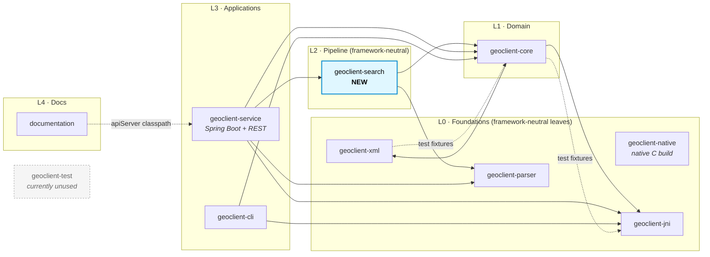

# Subproject Dependency Graph

Snapshot of the inter-module `project(...)` dependencies across the Geoclient
Gradle build, extracted from each subproject's `build.gradle`.

## Diagram



## Cycles

**None.** The main-compile graph is a DAG with a clean topological order:

```
{jni, xml, parser}  →  core  →  search  →  service
                       ↑         (also: cli → {jni, core})
                       └── service depends on jni, core, parser too (directly)
                               └── documentation → service
```

The only edges that look bidirectional are the test-fixture arrows
(`geoclient-xml`'s tests depend on `geoclient-core`'s test fixtures, and
`geoclient-core`'s tests depend on `geoclient-jni`'s test fixtures). Those
live on the `testImplementation` classpath, not `implementation`, so they
cannot create a compile cycle — Gradle happily allows a module's tests to
consume test artifacts from a downstream module.

## Separation of concerns

| Layer | Modules | Role | Framework coupling |
|---|---|---|---|
| L0 | `geoclient-native` | C sources compiled to `libgeolientjni.so` | none |
| L0 | `geoclient-jni` | Java↔C JNI bridge | none |
| L0 | `geoclient-xml` | Reads `geoclient.xml` field/function definitions | none |
| L0 | `geoclient-parser` | Regex-based NYC location parser | Jackson (annotations only, for XML config) |
| L1 | `geoclient-core` | `GeosupportFunction`, `WorkArea`, `Field`, `Filter` | none |
| L2 | `geoclient-search` | Single-field search pipeline | **none in own source** (framework-neutral SPI) |
| L3 | `geoclient-service` | REST endpoint + Spring wiring | Spring Boot, Jackson, jakarta.servlet, jakarta.validation |
| L3 | `geoclient-cli` | Command-line tool | none |
| L4 | `documentation` | AsciiDoc guide | consumes service's `apiServer` config only |
| — | `geoclient-test` | Shared test-support utilities | **currently orphaned** — no other module depends on it |

## Observations & concerns worth flagging

1. **`geoclient-test` is orphaned.** No subproject imports it. Its own `README`
   in the repo notes it holds `GeosupportIntegrationTest` /
   `NativeIntegrationTest` per `.github/copilot-instructions.md`, but those
   base classes aren't wired to consumers today. Worth investigating whether
   it's dead code or an in-progress refactor.

2. **`geoclient-search` transitively pulls Jackson via `geoclient-parser`.**
   The invariant preserved by the extraction is stronger than "no Jackson on
   the classpath" — it's "no Jackson types in the search module's own source
   or public API". That's still true (verified with grep). If you want strict
   runtime isolation, `geoclient-parser` would need to be split into a
   framework-neutral core and a Jackson-based config loader.

3. **`geoclient-service` has a small redundancy** — it lists `geoclient-core`
   and `geoclient-parser` explicitly on both the main and integrationTest
   classpaths (lines 7-8 and 94-95 of `geoclient-service/build.gradle`).
   Harmless, but the integrationTest entries are unnecessary since
   `implementation project()` in the test-conventions suite already pulls the
   main classpath in transitively.

4. **Fan-in on `geoclient-core` is high** — depended on by search, service,
   and cli. That's expected for a domain module but means changes to
   `GeosupportFunction` / `WorkArea` / `Field` ripple through the entire
   application graph. Consider it a stable public API and treat breaking
   changes accordingly.

5. **`geoclient-service` has a wide dependency fan-out** (4 project deps
   directly). Now that `geoclient-search` transitively re-exports
   `geoclient-core` and `geoclient-parser`, you *could* drop those explicit
   `implementation` lines from service — but only if you're confident no
   service source directly imports from them (`RestController` and various
   service utilities do, so today those direct deps are correct). Leaving
   them explicit is the safer choice.

6. **No layer skip except at the app tier.** `geoclient-cli` skips search
   (uses core+jni directly), which is fine — the CLI does raw Geosupport
   calls, not single-field search. If TODO item #1 in
   `.github/copilot-instructions.md` (make search reusable from CLI) is
   picked up, the CLI would gain an edge to `geoclient-search` and the graph
   stays acyclic.

## Regenerating this diagram

The `project(...)` dependency edges above were extracted with:

```sh
for m in geoclient-jni geoclient-xml geoclient-core geoclient-parser \
         geoclient-search geoclient-service geoclient-cli geoclient-test \
         geoclient-native documentation; do
  if [ -f "$m/build.gradle" ]; then
    echo "===== $m ====="
    grep -nE "implementation|api|compileOnly|runtimeOnly|testImplementation|testFixtures" \
      "$m/build.gradle" | grep -E "project\(" | sed "s|^|  |"
  fi
done
```

For an authoritative view including transitive resolution, use Gradle's
built-in reports:

```sh
./gradlew :geoclient-service:dependencies --configuration runtimeClasspath
./gradlew projects
```
